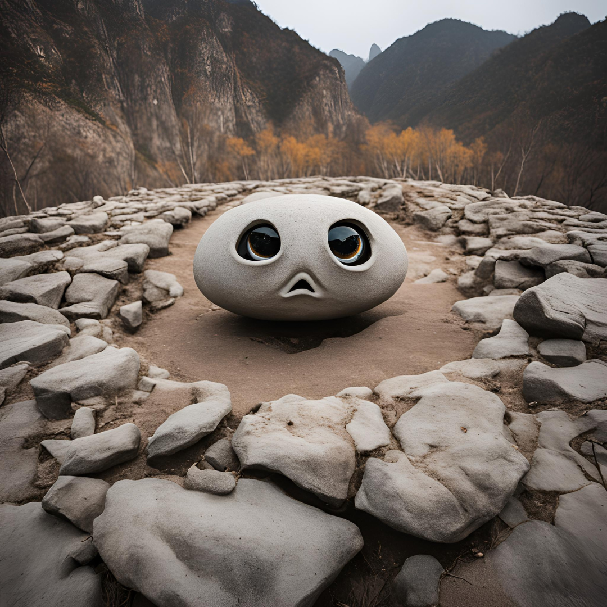
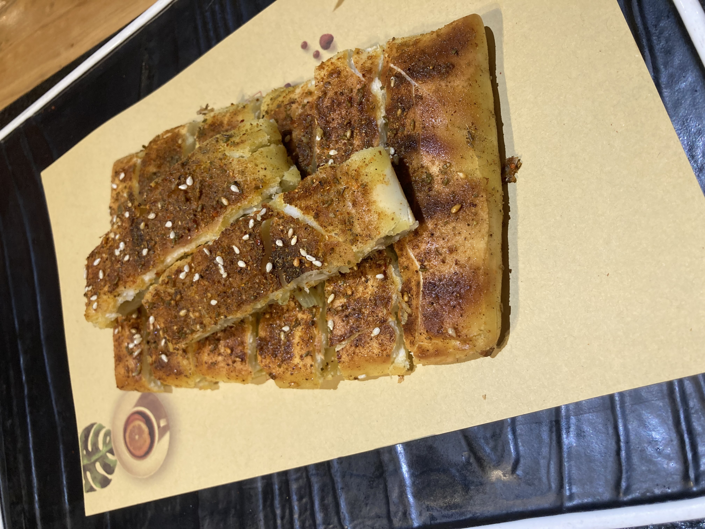
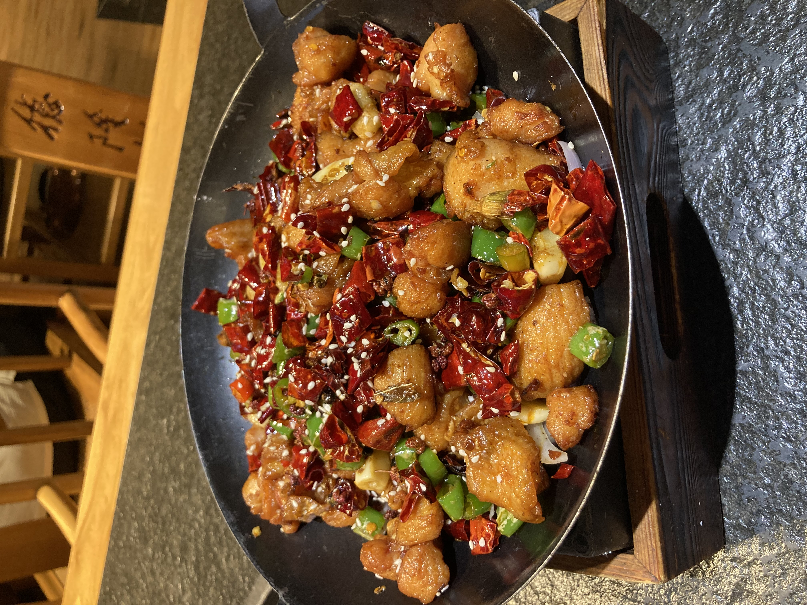

# Il était une fois un petit caillou au milieu de la Chine

Ça y est, je suis un petit caillou perdu en Chine. Ça fait un peu bizarre d'être toute seule dans ce grand pays, au milieu d'1,5 milliards de chinois·es qui me regardent bizarrement dans la rue. C'est un vrai truc ça. Depuis que je suis arrivée, il n'y a pas un jour qui soit passé sans qu'un enfant (même des adultes parfois) me fixe, s'approche de moi pour me voir de plus près ou dit à ses parent que je suis une *wàiguórén* (étrangère). Ça se produit tellement que je sais le lire sur les lèvres des enfants quand ils chuchotent 😂. 
Il y a quelques jours, on était au restaurant, et y'a un enfant qui est venu de derrière moi, a avancé s'est retourné pour me voir et est retourné s'assoeoir. Il a cru qu'il était discret. Et moi je le voyais pas parler à ses amis derrière moi, mais Boris m'a dit qu'il a mimé mes grands yeux à ses copains😯. C'était vraiment très drôle. 

Donc pour pas déprimer toute seule, je me suis fixée des petites missions pour sortir, visiter et essayer de parler chinois. Bon, mes missions c'est pas des trucs de ouf, elles consistent surtout en faire des petites courses. 

L'expérience course/shopping c'est quelque chose aussi. Les vendeur·euses me suivent à la trace pour m'aider, même quand je veux juste prendre une crème hydratante à Sephora ! Mais bon,je m'habitue. En plus, ça fait un bon entrainement dans les cabines d'essayage pour dire "c'est trop grand", "c'est trop petit", "j'aime bien" et elles proposent d'autres vétements, du coup je révise les vêtements et les couleurs aussi c'est cool.
Et pour me récompenser d'avoir bien travaillé mon chinois, je me suis acheté un petit chemisier rouge🙂.

##Bonus : Photos de mon dîner

Très très bon feuilleté, avec des épices par dessus, ça avait beaucoup de goûts !

Super bon aussi mais un peu trop de piments quand même. Je mange pas mal épicé hein, Mais là ça faisait trop haha. 

Vous vous en rendez sûrement compte sur les photos, ça fait un peu beaucoup pour une seule personne donc ma dernière mission de la journée a été de demander une boîte à emporter. J'ai bien précisé "boîte" parce que sinon ils auraient été capable de mettre le poulet dans un sachet plastique (ils aiment beaucoup mettre la nourriture dans les sachets platiques😂).

